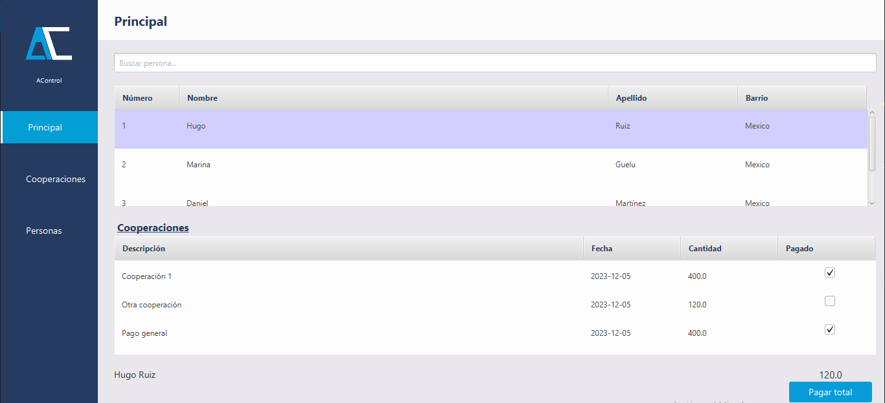
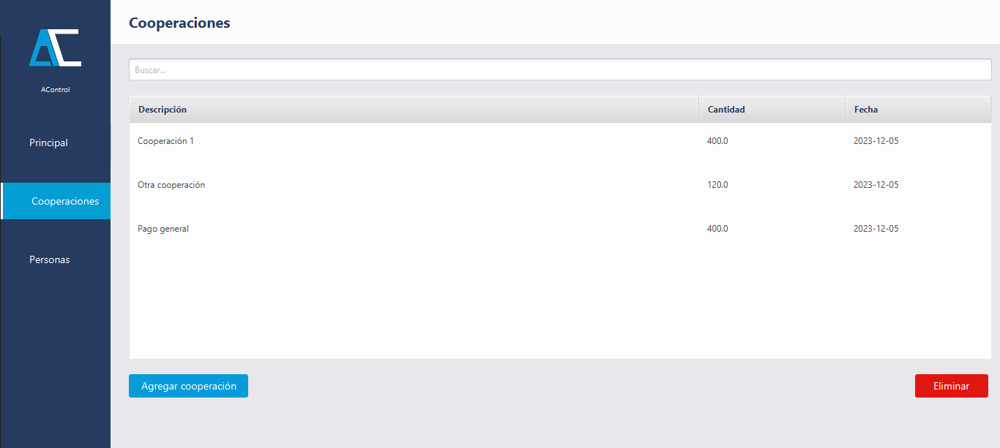
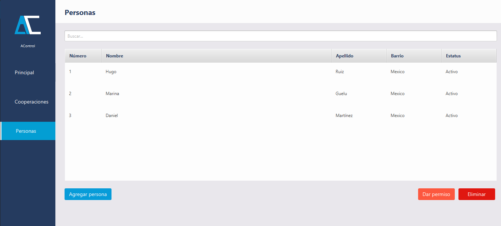

# AControl

AControl is a desktop application that helps organizations track **cooperation payments**. It allows you to register people and their contributions, keeping a clear record of who has paid and who still has pending contributions.

### Features
* Register people
* Record new contributions
* Track which people have already paid
* View pending contributions

---

### Tech Stack
* **Java** (tested on Java 11 and 17)
* **Hibernate**

---

### Setup & Installation

1.  **Clone the repository**
    ```bash
    git clone https://github.com/hugoruiz00/acontrol
    ```

2.  **Configure the database**
    Edit the configuration file located at `acontrol\target\classes\hibernate.cfg.xml`.

3.  **Run the project**
    You can run the project using VS Code, NetBeans, or any other Java IDE.

---

## License

This project is licensed under the MIT License - see the [LICENSE](LICENSE) file for details.


### Screenshots

##### Cooperation payments by person


##### Cooperation payments


##### List of people
